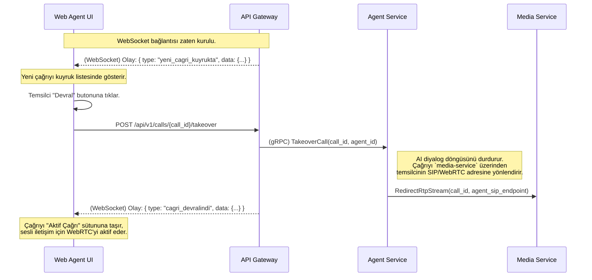

# 🖥️ Sentiric Web Agent UI - Mantık ve Akış Mimarisi

**Belge Amacı:** Bu doküman, `web-agent-ui`'nin Sentiric platformunda **insan ve yapay zeka işbirliğinin gerçekleştiği kokpit** olarak stratejik rolünü, temel çalışma prensiplerini ve `api-gateway` ile olan gerçek zamanlı iletişimini açıklar.

---

## 1. Stratejik Rol: "İnsan-AI İşbirliği Kokpiti"

Bu arayüz, platformun otomasyon yeteneklerinin insan zekası ve empatisi ile birleştiği yerdir. AI'ın bir görevi çözemediği veya kullanıcının özellikle bir insanla konuşmak istediği durumlarda devreye girer.

**Bu arayüz sayesinde:**
1.  **Sorunsuz Devir Sağlanır:** Bir AI diyaloğu, tek bir tıklama ile bir insan temsilciye, konuşma geçmişi ve müşteri bilgileriyle birlikte sorunsuz bir şekilde aktarılabilir.
2.  **Verimlilik Artar:** Temsilci, bir çağrıyı devraldığında, müşterinin kim olduğunu, daha önce ne konuştuğunu ve ne istediğini anında görür. Bu, "Sorununuzu baştan anlatır mısınız?" cümlesini ortadan kaldırır.
3.  **Gelişmiş Destek Mümkün Olur:** "Fısıldama" (Whisper) gibi özellikler sayesinde, bir süpervizör veya AI, temsilcinin kulağına müşterinin duymadığı ipuçları veya çözümler fısıldayarak destek olabilir.
4.  **Gerçek Zamanlı Farkındalık Sağlanır:** Temsilciler, beklemedeki çağrı kuyruğunu, aktif görüşmeleri ve diğer temsilcilerin durumunu anlık olarak izleyebilir.

---

## 2. Temel Çalışma Prensibi: WebSocket ve REST API

Arayüz, `api-gateway` ile iki temel kanal üzerinden iletişim kurar:

*   **WebSocket (Gerçek Zamanlı Olaylar İçin):** Uygulama açıldığında, `api-gateway`'e kalıcı bir WebSocket bağlantısı kurulur. `yeni_cagri_geldi`, `cagri_sonlandi`, `yeni_transkript_eklendi` gibi anlık olaylar bu kanal üzerinden arayüze push edilir. Bu, ekranın sürekli güncel kalmasını sağlar.
*   **REST API (Eylemler İçin):** Temsilcinin yaptığı her eylem (bir çağrıyı devralmak, bir mesaj fısıldamak, çağrıyı sonlandırmak) için `api-gateway`'in ilgili REST endpoint'ine bir HTTP isteği gönderilir.

---

## 3. Uçtan Uca Akış: Bir Çağrının Devralınması

